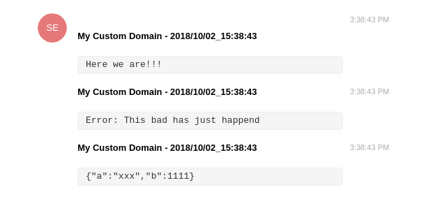

# teloggo

Use telegram like `console.log`

It will handle long message and object as input.

No external dependencies.

### Usage

```bash
npm install --save teloggo
```

```js
const teloggo = require('teloggo');

const domain = 'My Custom Domain'; // it's about your creativity
const token = 'XXXXXXXX:YYYYYYYYYYYYYYYYYY'; // from BotFather
const chatId = 10000; // if you don't know you can use the teloggo.getId method

var logger = new teloggo({
  domain: domain,
  token: token,
  chatId: chatId
});

// send string
logger.log('Here we are!!!');

try {
  throw new Error('This bad has just happend')
} catch (e){
  //send errors
  logger.log(e);
}

// send object
logger.log({a: 'xxx', b: 1111})

```
And you'll receive a message on your telegram.




### How to get chatId

if you want to know the chatId you can write a simple app:

```js
// ./givemeMyId.js

const teloggo = require('teloggo');

const token = 'XXXXXXXX:YYYYYYYYYYYYYYYYYY'; // from BotFather

var logger = new teloggo({
  token: token
});

logger.getId();
```

then you can send a message to your bot with `/getId` and run the program you write `node ./givemeMyId.js`, it will output your chatId
